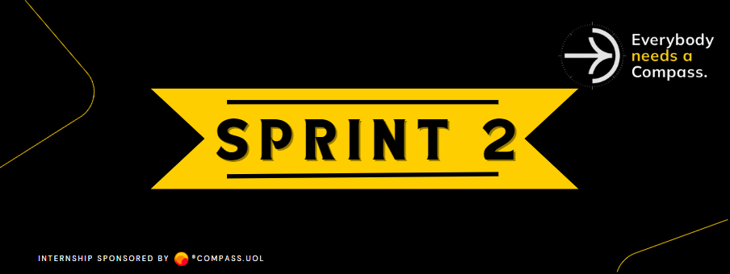

    

## Conteúdos da Sprint:

- User Stories & Issues.
- Conceitos básicos para testes de API.
- Testes Estáticos.
- Tipos de erros comuns.
- Validações em APIs.
- Boas práticas.
- Planejamento de testes.
- Cobertura de testes.
- Análise de testes.
- Mapas mentais e testes.
- Introdução ao Postman.
- Ferramentas de apoio ao QA.

