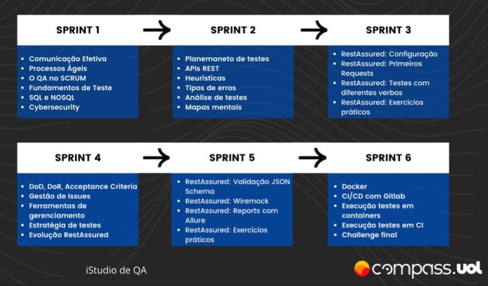

# Projeto Compass.UOL

Olá! Este será um repositório de conteúdos abordados durante a trilhagem de estudos do Programa de Bolsas [Compass.UOL](compass.uol/) - Automação de Testes em Java Backend, com o começo em 22/05/2023 e duração de 3 meses. 

Será dividido em 6 Sprints, com a duração de 15 dias cada. Ao final de cada Sprint será feito uma Challenge, que é uma reunião mais longa com o objetivo de apresentar um resumo do Sprint que passou.  
- [Sprint 1](https://github.com/guilhermesvm/projeto-CompassUOL/tree/pb_sprint1) - Processos Ágeis e Fundamentos de Teste
- [Sprint 2](https://github.com/guilhermesvm/projeto-CompassUOL/tree/pb_sprint2) - Análise e Testes de APIs REST
- [Sprint 3](https://github.com/guilhermesvm/projeto-CompassUOL/tree/pb_sprint3) - Automação de Testes com RestAssured
- [Sprint 4](https://github.com/guilhermesvm/projeto-CompassUOL/tree/pb_sprint4) - DoD, DoR e boas práticas com RestAssured
- [Sprint 5](https://github.com/guilhermesvm/projeto-CompassUOL/tree/pb_sprint5) - RestAssured++
- [Sprint 6](https://github.com/guilhermesvm/compass-challengeSicredi) - Docker, CI e Challenge Final

* Imagem ilustrativa que mostra todo caminho percorrido.

    

