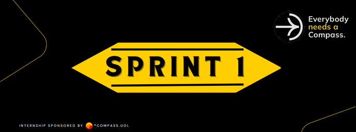

    
    <h1> Sprint 1 - Processos Ágeis e Fundamentos de Teste </h1>

## Conteúdos da Sprint:

- Matriz de Eisenhower
- Git, GitHub e GitLab
- Como criar bons READMEs
- Comunicação em Projetos
- Fundamentos de Agilidade
- Organização em Equipes
- O QA Ágil
- Fundamentos de Teste (back-end)
- Pirâmide de Testes
- Regra 10 de Myers
- Princípio de Pareto
- Introdução ao Java (Curso em Vídeo)
- Fundamentos de CyberSecurity
