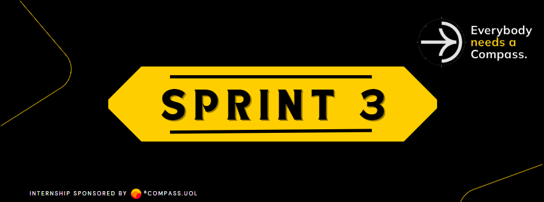

    
    <h1> Sprint 3 - Análise e Testes de APIs REST
 </h1>

## Conteúdos da Sprint:

- Introdução ao RestAssured;
- Realização dos primeiros requests utilizando RestAssured;
- Utilização de diferentes verbos HTTP nos testes;
- Hooks nos testes automatizados;
- Prática com challenge RestAssured.
