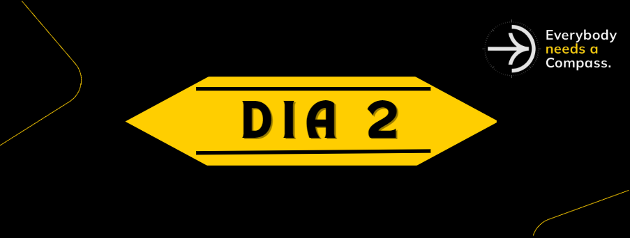

    
    <h1> Dia 2 </h1>
    
 [Comunicação em Equipe](#Comunicação em Equipe)

    
 [Scrum](#Scrum) 

## Comunicação em Equipe
Foi introduzido um slideshow com temas importantes que uma equipe bem estruturada e com uma boa relação deve ter:
- A constante troca de informações e ideias;
- Incentivo da cultura de feedback;
- Diferencial de um líder para um chefe;
- Jeitos de tornar reuniões mais produtivas e eficazes;
- Momentos de descontração que criam um laço amigável mais forte entre os membros;

## Scrum
É um framework que traz soluções simples, ajudando times à gerenciar projetos complexos.

> Framework é uma estrutura base para a construção de aplicações web de finalidade específica, cujo desenvolvimento pode ser muito custoso e/ou problemático. Com um framework é possível construir sites, aplicativos e softwares a partir de um esqueleto pré-definido, alterando apenas demais particularidades.  

> É utilizado para que uma aplicação possa ser desenvolvida de maneira mais ágil, rápida e sem problemas que já foram resolvidos por outros profissionais.

### Pilares Fundamentais
📖 **Transparência**: Transparênciados processos, requisitos de entrega e status do projeto. 
🔎 **Inspeção**: Inspeção constante do que está sendo feito em um projeto a partir de reuniões diárias, a fim de detectador problemas e adversidades. 
🕸**Adaptação**: Adaptação do projeto, mesmo enquanto do produto está sendo desenvolvido.

### Scrum Team
| Papéis       |                   |         |
|--------------|-------------------|---------|
|Scrum Master  |Product Owner (PO) | Dev Team| 

**Scrum Team**: Pequeno time ágil de profissionais (squads) autônomos com um objetivo final comum : entrega do produto. 
**Product Owner**: É o líder do produto, possui contato com  os backholders, decide quais recursos e funcionalidades serão implementados, e em qual ordem. 
**Scrum Master**:  É o facilitador, promovendo orientação, colaboração, um ambiente de trabalho estável, comunicativo e amigável.  
**Dev Team**: São os que planejam, estimam e executam desenvolvimento do produto durante as Sprints. 

### Sprints
|Eventos                   |                 |                      |              |                    |
|--------------------------|-----------------|----------------------|--------------|--------------------|
|Sprint Planning           |Sprint Execution |Daily Scrum           | Scrum Review |Retrospective Sprint|

➡️**Sprint Planning**:  É uma reunião inicial entre o Scrum Team. O PO apresenta o Product Backlog e a equipe determina quais histórias serão capazes de completar durante a Sprint que está por começar. 
➡️**Sprint Execution**: Desenvolvimento do projeto. 
➡️**Daily Scrum**: Reunião diária feita com o Time Dev, que tem duração de até 15 minutos e nela são discutidos 3 pontos: “O que você fez ontem?”, “O que você fará hoje? ” e “Houve algum impedimento?”. 
⬅️**Scrum Review**: Tem por objetivo a inspeção do Incremento desenvolvido naquela Sprint e adaptação do Product Backlog caso necessário. 
🔁**Retrospective Sprint**: Evento que fecha a sprint, no qual o time verifica possíveis necessidades de aptação, o que teve de positivo e negativo, para decidir que práticas devem continuar ou parar. 

### Artefatos Scrum
| Artefatos     |              |                  |
|---------------|--------------|------------------|
|Product Backlog|Sprint Backlog|Delivery/Increment|

**Product Backlog**: PO descreve e prioriza por importância os itens que estão do topo à base do Backlog, esses devem estar claros para o Dev Team, com o fim de entregar maior valor de negócio ao produto.  
**Sprint Backlog**: Lista de histórias divididas que precisam ser feitas durante uma Sprint, gerando a Sprint Task. 
**Delivery/Increment**: Soma de todas histórias completados durante a Sprint e das Sprints anteriores. No final, um novo incremento deve ter atendido todos os requisitos e ser aprovado para ser considerado "Done".

### Exemplo de um Scrum na Prática
- PO apresenta à todos a visão de produto dos stakeholders;
- PO, com auxílio do Scrum Master, organiza a visão em histórias que serão inseridas no Product Backlog ;
- Sprint Planning e Sprint Backlog;
- Sprint Execution;
- Sprint Review;
- Sprint Retrospective;
- Increment/Delivery;
- Repetição do processo até ter o produto final.

    

### Ferramentas
- BurndownChat: gráfico que demonstra uma relação de histórias à fazer com o tempo disponível.
- Kanban: mostra as tarefas em espera, andamento e concluídas, ajudando na visualização e organização do fluxo de trabalho.
