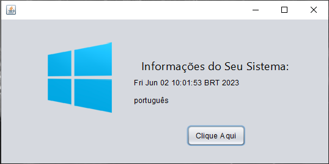

## Exercícios (Ep. 1)
**Algoritmo** - descrição das etapas de resolução de um problema ou indicação ordenada de uma sequência de ações bem definidas.<br/>
**Compilador** - transforma código-fonte em código-objeto.<br/>
**Linker** - transforma  código-objeto em código-executável.<br/>
**Interpretador** - transforma código-fonte diretamente em código-executável.<br/>

## Exercícios (Ep. 2)
Um código compilado ocupa mais memória, mas leva menos tempo para executar. Um código interpretado ocupa menos memória, mas leva mais tempo para executar.

## Exercícios (Ep. 4)
**MOSTRA A HORA DO SISTEMA:**

```
package horadosistema;
import java.util.Date;
public class HoraDoSistema {

    public static void main(String[] args) {
        Date relogio = new Date();
        System.out.println("A hora do sistema é");
        System.out.println(relogio.toString()); //imprime  a hora
    }
}
```

**MOSTRA O IDIOMA DA MÁQUINA:**
```
package idiomadosistema;
import java.util.Locale;
public class IdiomaDoSistema {
    public static void main(String[] args){
        Locale loc = Locale.getDefault();
        System.out.println("A linguagem do sistema é:");
        System.out.println(loc.toString()); // imprime "pt_Br"
        System.out.println (loc.getDisplayLanguage()); // imprime "Português"
    }
}
```
**MOSTRA A RESOLUÇÃO DO MONITOR**

```
package resolucaotela;

import java.awt.Dimension;
import java.awt.Toolkit;

public class ResolucaoTela {
    public static void main(String[] args) {
        Toolkit tk = Toolkit.getDefaultToolkit();
        Dimension d = tk.getScreenSize();
        System.out.println("Largura da tela = " + d.width);
        System.out.println("Altura da tela = " + d.height);
  }
}
```

## Exercícios (Ep. 5)
- Java diferencia letra maiúsculas de minúsculas.<br>
- Palavra-chave **"new"** introduz a criação de um objeto.<br>
- O método **"main"** é o ponto de partida de cada aplicativo Java.<br>
- A classe **"Stack" possui métodos de manipulação em pilhas e está definido no pacote **java.util**<br>

- [x]  Mostrando informações do computador com Swing.

<div align="center">
    
</div>

## Exercícios (Ep. 6)
<div align="center">
    
</div>
