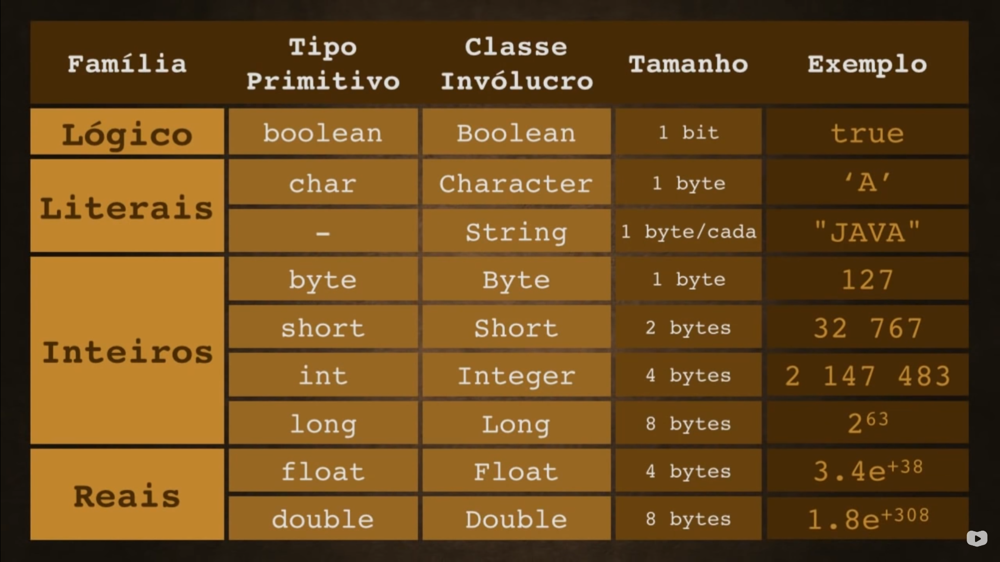

<div align="center">
    
    <h1> Java Básico </h1>
    <p> [Curso em Vídeo (Java) - Ep.5 ao 13](#Curso em Vídeo (Java) - Ep.5 ao 13) </p>
</div>

# Tipos Primitivos e Manipulação de Dados(Ep. 6)

|Variável                 | Variável com Typecast           |Variável  como um objeto             |
|-------------------------|---------------------------------|-------------------------------------|
|int idade = 3;           |int idade = (int) 3;             |Integer idade = new Integer(3);      | 
|float salario = 1825.45f;|float salario = (float)1825.45;  |Float salario = new Float(1825.45);  |
|chat letra = 'G';        |chat letra = (char) 'G';         |Character letra = new Character('G');|
|boolean casado = false;  |boolean casado = (boolean) false;|Boolean casado = new Boolean(false); |

<div align="center">
    
</div>

 
## Saída de Dados
**Tipos de Saída**
```
float nota = 9.5f;
    System.out.print("Sua nota é:" + nota);
    System.out.printf("Sua nota é: %.2f", nota);
    System.out.format("Sua nota é: %.2f", nota);
```
**Exemplo com a saída já programada.**
```
public class TiposPrimitivos {
    public static void main(String[] args) {
        String nome = "Guilherme";
        float nota = 9.5f;
        System.out.format("A nota de %s é %.2f.", nome , nota);
    }
}
```

## Entrada de Dados
**Exemplo feito de modo que o usuário coloque os dados.**
```
import java.util.Scanner;
public class TiposPrimitivos2 {

    public static void main(String[] args) {
        Scanner teclado = new Scanner(System.in);
        System.out.println("Digite o nome do aluno: ");
        String nome = teclado.nextLine();
        System.out.println("Digite a nota do aluno: ");
        float nota = teclado.nextFloat();
        System.out.format("A nota de %s é %.2f.", nome , nota);
    }
}
```
## Integer para String e Vice-Versa

```
public class TesteTipos {
    public static void main(String[] args) {
        int idade = 30;
        String valor = Integer.toString(idade);
        System.out.print(valor);
        
        String valor = "30";
        int idade = Integer.parseInt(valor);
        System.out.print(idade);
    }
}
```
## Criando Tabela de Soma com Swing

<div align="center">
    
</div>

Método Getter: pega o valor que está dentro (lblResultado.getText()).<br>
Método Setter: colocar um valor dentro (lblResultado.setText()).
        
```
    private void btnSomaActionPerformed(java.awt.event.ActionEvent evt) {                                        
        int n1 = Integer.parseInt(txtN1.getText());
        int n2 = Integer.parseInt(txtN2.getText());
        int soma = n1 + n2;
        lblSoma.setText(Integer.toString(soma));
    }  
´´´

# Operadores Aritméticos e Classe Math (Ep. 7)
