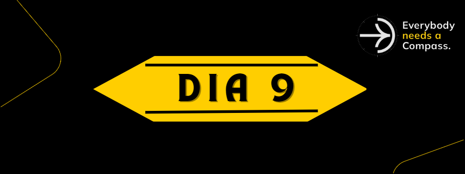

    
    <h1> Dia 9 </h1>
    
 [CyberSecurity](#CyberSecurity) 

## 🎭 Como Não Ser Hackeado e Perder Informações
1. Pishing: não clicar em links desconhecidos e suspeitos nos recebidos em emails.
2. Não compartilhar WiFi com vizinhos, conectar em redes públicas gratuitas e de fácil acesso (shoppings, aeroportos).
3. Selecionar quais informações serão colocadas em redes sociais.
4. Não utilizar a mesma senha para tudo.
5. Ao notar ações suspeitas no computador, avisar a segurança.
6. Fazer backup dos arquivos.
7. Alvos de hackers não são sistemas, e sim pessoas.

## OWASP TOP 10 - 2021
O OWASP (Open Web Application Security Project) é um projeto que colabora com o objetivo de aprimirar a segurança do software. Um de seus trabalhos mais importantes é um relatório Top 10 de maiores vulnerabilidades de segurança na web.

## 🏠 Segurança de Rede WiFi Doméstica

### Tipos de Ameaça:
- **Sequestro de DNS**: ocorre quando invasor tem acesso às configs do roteador, e nele pode inserir um servidor mal intenciado que conduz para sites maliciosos idênticos aos originais, porém com a finalidade de roubar;

- **Botnets e Proxy**: ataque de DDOS a partir de sequestro de roteador, com o hacker podendo usar o seu mesmo IP para ações ilegais;
- **Monitoramento de Tráfego**;

 ### Como se Previnir Pessoalmente?
- Alterar informações padrões do roteador;
- Utilizar WPA2 e AES256 (criptografia);
- Alterar periodicamente nome e senha da rede;
- Bloquear dispositivos desconhecidos;
- Ocultar nome da rede;
- Ativar Firewall do roteador.

### Como se Previnir no HomeOffice
- Evitar acessar ambiente de trabalho em redes públicas;
- Usar senhas fortes e alterá-las periodicamente;
- Verificar atualização de antivírus;
- Atualizar sistema com patchs disponibilizados pela própria empresa.

## CyberSecurity - Dicas de Proteção
- Utilizar senhas boas;
- Usar um gerenciador de senhas (LastPass);
- Utilizar autenticação multifator (Google/Microsoft Authenticator);
- Extensões **uBlock** e NoSript Security para navegador;
