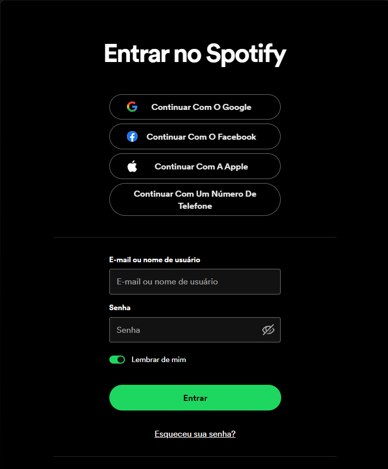
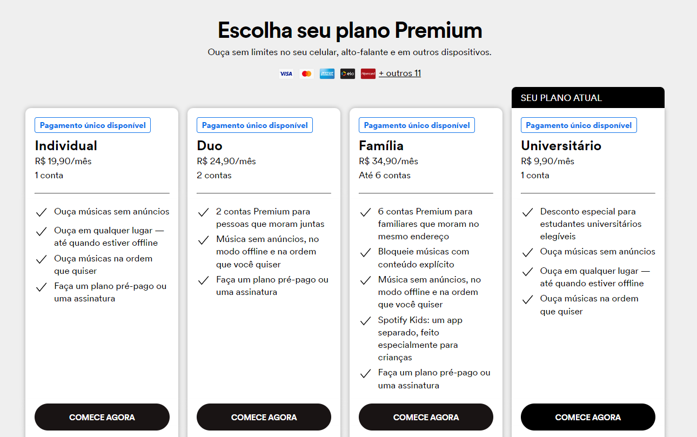
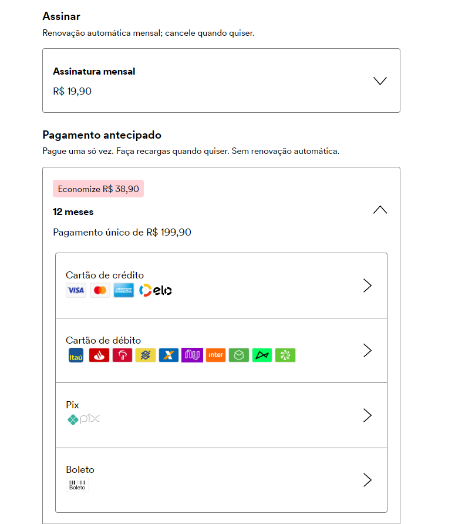

    
    <h1> Dia 6 </h1>
    
[Priorização em Diferentes Aplicações](#Priorização em Diferentes Aplicações)

## Priorização em Diferentes Aplicações
Um analista deve sempre priorizar os fluxos obrigatórios para um projeto, que vão fazer com que a aplicação atinja seu objetivo final com a funcionalidade esperada. Exemplo de **testes prioritários** em **E-Commerce**:
- Principal objetivo: Compra/venda;
- Login/cadastro: Se não tiver feito login ou cadastro, não há como comprar ou vender;
- Adicionar produto na sacola;
- Pagina de sacola deve estar funcionando;
- Cadastro de endereço;
- Formas de pagamento;
- Formas/datas de entrega;
- Realizar pagamento;

Exemplo de **testes prioritários** em **Site de Pontos de Fidelidade**:
- Principais objetivos: resgate de pontos por produtos e serviços, compra e transferência de pontos, e venda de pontos para o site.

Exemplo de **testes prioritários** em **Site de Telefonia**:
- Principais objetivos: recarga de celular, 2ª via de conta móveis, consulta de saldo, pagamento de contas com cartão, etc.

Exemplo de **testes prioritários** em **Fluxo de Demandas**:
- Principal objetivo: fazer alterações de acordo com a demanda do cliente.

## Atividade 
**Escolher segmento e aplicação na internet, e criar lista de fluxos de teste prioritários dentro de cada aplicação.**  
Passo 1 - Apresentar a aplicação, o segmento e o objetivo principal do sistema.  
Passo 2 - Elaborar lista de fluxos de validação prioritários no sistema escopo;  
Passo 3 - Ordenar a lista de forma lógica.

## Introdução
A aplicação escolhida para realizar a atividade foi a plataforma [Spotify](#https://open.spotify.com/intl-pt), presente no segmento de streaming de música e podcast digitais. Tem como objetivo proporcionar acesso instantâneo, gratuito ou premium,  à milhões de músicas de diversos gêneros e podcasts de músicos/criadores de conteúdo atuais e antigos em diversas qualidades.

    

## Fluxos Obrigatórios
### FLUXO DO OUVINTE/USUÁRIO :
-  **Principal objetivo:**
   - Ouvir música;
   - Compartilhar nas redes sociais;
   - Organizar em playlists;

1. **Cadastro:** Usuário deve preencher um cadastro com suas informações, como nome, email, senha e data de nascimento.

    

2. **Login:** Após o cadastro, o login deve ser feito com as informações previamente cadastradas.

    

3. Pronto! Usuário agora pode ouvir músicas, compartilhar em redes sociais, criar playlist editáveis para organizar em estilos musicais preferidos, etc.

### FLUXO DO OUVINTE/USUÁRIO PREMIUM: 
-  **Principal objetivos:** Benefícios gratuitos +
   - Possibilidade de  baixar no dispositivo para ouvir onde estiver;
   - Ouvir sem anúncios;
   - Ouvir em qualquer ordem;
   - Qualidade de som superior;

1. Usuário deve escolher a modalidade de plano de assinatura (Individual, Duo, Família ou Universitário), a duração (1/3/6/12 meses) e aceitar os Termos de Assinatura.

    

2. Usuário deve escolher a forma de pagamento (cartão, boleto, pix) e preencher o formulário.

    

3. Pronto! Usuário se torna Premium e garante vários benefícios.

### Outros Fluxos
- Cadastro utilizando Google, Facebook;
- Login utilizando Google, Facebook, Apple;
- Troca de senha ao não conseguir fazer o login;
- Layout do perfil do usuário;
- Fluxo do Criador de Conteúdo/Músicos (publicar músicas/checar royalties, etc.)
