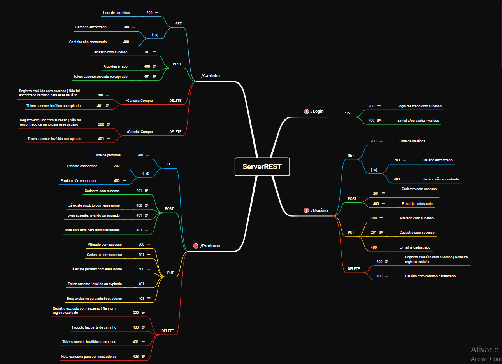

    
    <h1> Dia 7 </h1>
    
[Análise HTTP e API REST](#Análise HTTP e API REST)

    
[Mapas Mentais](#Mapas Mentais)

## Análise HTTP e API REST
Vídeo mostrando uma análise da documentação swagger da API [ServerRest](https://serverest.dev/#/), mostrando suas funcionalides, como parâmetros, métodos, requisições, respostas, etc. Também foi mostrado tratamentos que estão faltando/errados na hora da execução, em sua maioria resposta de erro, com o objetivo de afiar nossos olhos para prever fechar lacunas de várias situações. O que está faltando deve ser relatado em Issues e documentado na hora de criar um mapa mental.

Exemplos de **Issues**:
- Mensagem de Erro: Usuário tenta logar sem email ou senha.
- Mensagem de Erro: Servidor não está funcionando.
- Mensagem de Erro: Tentar logar com o email que não está na base de dados.
- Mensagem de Erro: Não é permitido cadastrar usuário com email já utilizado.
- Mensagem de Erro: Erro ao tentar cadastrar senha fora do padrão
- Mensagem de Erro: Tentar fazer cadastro com  sem informações obrigatórias
- Mensagem de Erro: Tentar fazer cadastro com  sem informações obrigatórias
- Mensagem de Erro: Não é permitido excluir usuário com produtos no carrinho.
- Mensagem de Erro: Ao editar, não é permitido cadastrar usuário com email já utilizado.
 - Teste: Previsto teste para edição de usuário que não possui cadastro.

## Mapa Mental da APi ServeRest com XMind

    

