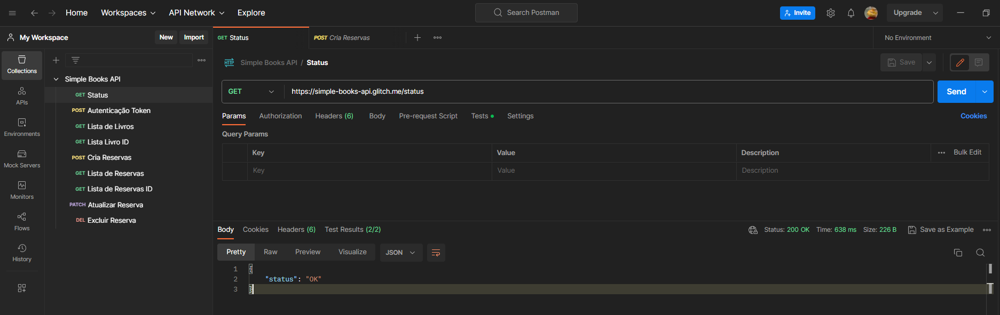

<div align="center">
    
    <h1> Dia 8 </h1>
    <p>[Introdução ao Postman](#Introdução ao Postman)</p>
    <p>[Postman em 1 Hora](#Postman em 1 Hora)</p>
</div>

# Introdução ao Postman (Curso Udemy)

Vantagens:
- Suporta qualquer tipo de chamada de API, sendo ela REST, SOAP ou HTTP.
- Fácil acesso: Login pode ser feito a qualquer momento e a qualquer lugar, todas as suas collections e workspaces estarão disponíveis.
- Criação de collections: É possivel se organizar requisições muito melhor, dentro de pastas referentes a cada uma, e utilizá-las mais facilmente.
- Facilita a elaboração detestes com pontos de verificação, validação de responses, integração contínua, automações, depuração e entre outros..
- Criação de ambientes, diminui a necessidade de repetição de testes, podendo também, usar  as mesmas coleções em ambientes diferentes.

- **Collections:** Contém pastas.
- **Pastas:** Contém requisições.
- **Requisições:** Contém instruções e dados para  realizar ações segundo contrato da API.

# Curso: Postman em 1 Hora
Curso: [Postman em 1 Hora](https://compassuol.udemy.com/course/aprenda-postman-em-1-hora-iniciante/learn/lecture/26276436#overview) realizado no Udemy. Todos os parâmetros e testes automatizados foram feitos na [Simple Books API ](https://github.com/escoladedevs/postman-em-1-hora).


## Como Fazer Testes Automatizados no Postman (Aula 12)
```{{$randomfullName}}``` - variável que cria um nome completo aleatório. <br>

**Verifica se o Status Code veio comforme o esperado.**
```
pm.test("Status deu certo?", function () {
    pm.response.to.have.status(200); 
});
```
**Verifica se veio um Body na response da API, conforme o esperado.**
```
pm.test("Body reponse ok?", function () {
    const responseJson = pm.response.json();
    pm.expect(responseJson.status).to.eql("OK");
});
```
**Verifica se o tempo de resposta foi menor do que o valor esperado:
```
pm.test("Tempo de execução menor do que 200ms", function () {
    pm.expect(pm.response.responseTime).to.be.below(200)
});
```

<div align="center">
    
</div>

